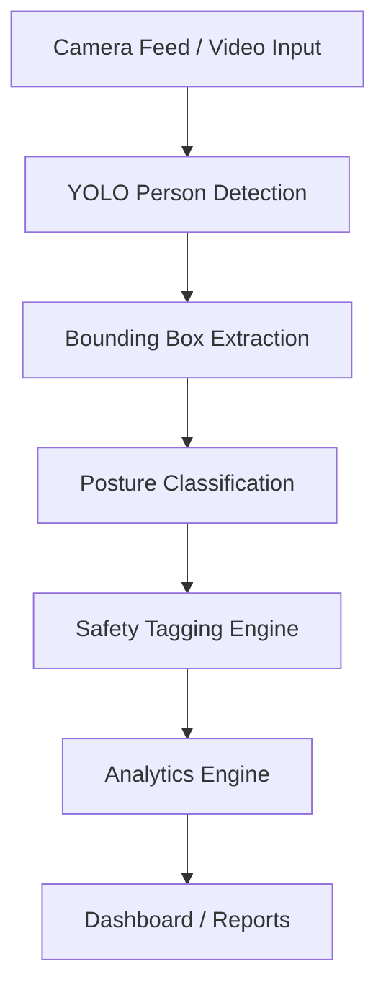
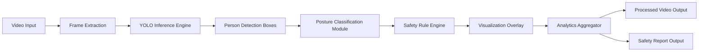
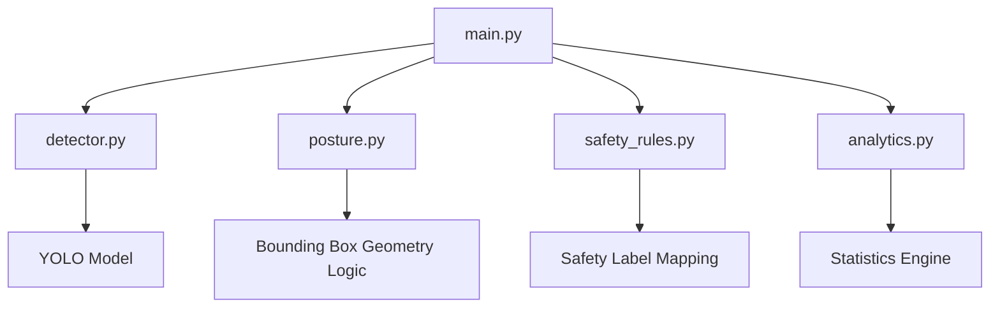
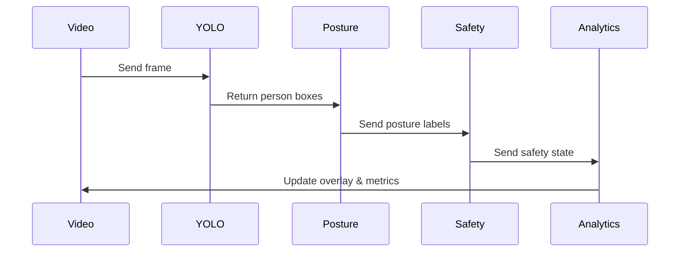
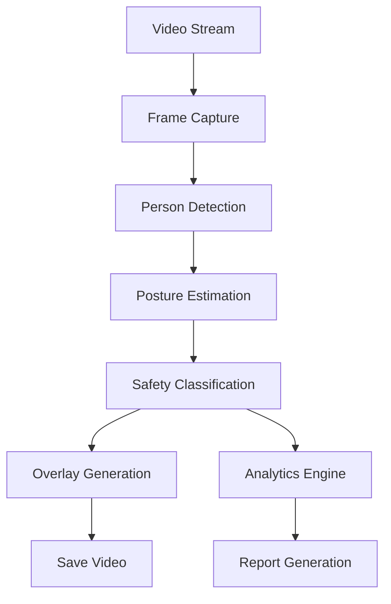
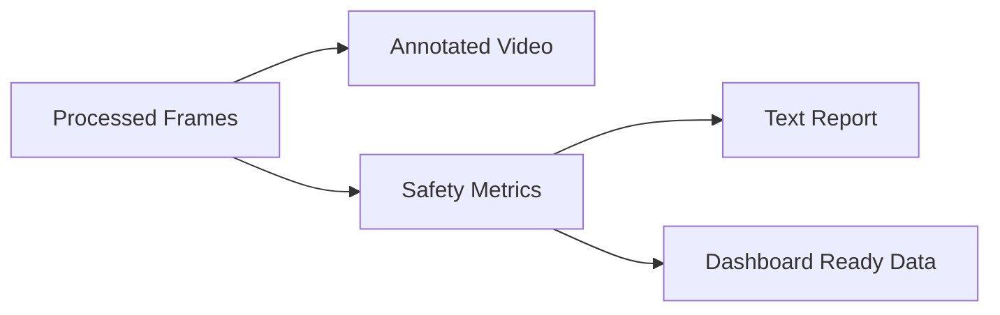

# 🛡️ AI-Powered Worker Posture & Safety Monitoring

## Computer Vision Prototype (YOLO + OpenCV)

An AI-powered safety intelligence layer that converts industrial camera footage into structured posture insights, safety alerts, and analytics.

---

# 📌 PART 1 — Problem Statement, Strategy & Product Alignment

## 1️⃣ Problem Context

Industrial environments such as factories, warehouses, and construction sites face continuous operational and safety challenges:

* Workers maintain unsafe postures leading to injuries
* Manual inspections are slow and inconsistent
* CCTV cameras capture footage but provide no intelligence
* Compliance documentation lacks automated evidence
* Safety violations are identified only after incidents occur

Organizations need an automated system that interprets camera feeds and extracts real-time safety insights.

---

## 2️⃣ Business Problem (Knowella Context)

Knowella builds AI-powered platforms focused on:

* Camera-powered inspections
* Safety compliance tracking
* Workflow automation
* Operational intelligence
* Video-based monitoring

However, raw video footage does NOT provide:

* Ergonomic risk detection
* Worker behavior intelligence
* Automated posture monitoring
* Safety analytics

This project introduces a **computer vision intelligence layer** that converts video into structured safety signals.

---

## 3️⃣ Proposed Solution

We design an AI module that:

1. Detects workers using a pretrained YOLO model

2. Classifies posture:

   * Standing
   * Sitting
   * Bending

3. Assigns safety labels:

   * SAFE
   * MONITOR
   * RISK

4. Generates analytics from video streams

This simulates an intelligent inspection camera system.

---

## 4️⃣ Alignment with Knowella’s Product Vision

This prototype directly supports:

* Video-powered inspections
* AI-driven safety monitoring
* Compliance documentation
* Operational productivity insights

It can act as a foundation for:

* Smart inspection cameras
* Ergonomic risk detection
* Automated safety reports

---

## 5️⃣ Conceptual System Flow



---

## 6️⃣ Safety Intelligence Mapping

| Posture  | Interpretation           | Safety State |
| -------- | ------------------------ | ------------ |
| Standing | Normal work behavior     | SAFE         |
| Sitting  | Idle / monitoring needed | MONITOR      |
| Bending  | Ergonomic risk           | RISK         |

---

## 7️⃣ Value Proposition

Transforms:

**Passive video → Active safety intelligence**

Enables:

* Injury prevention
* Compliance support
* Automated inspections
* Operational insights

---

# 🏗️ PART 2 — Technical Architecture

## 1️⃣ System Architecture Overview



---

## 2️⃣ Component-Level Architecture



---

## 3️⃣ Detection Pipeline Flow



---

## 4️⃣ Module Responsibilities

### `detector.py`

* Loads YOLO model
* Detects people in frames
* Returns bounding boxes

---

### `posture.py`

Posture estimation using bounding box geometry:

```
height / width ratio
```

* Tall box → Standing
* Medium → Sitting
* Short/Wide → Bending

---

### `safety_rules.py`

| Input    | Output  |
| -------- | ------- |
| Standing | SAFE    |
| Sitting  | MONITOR |
| Bending  | RISK    |

---

### `analytics.py`

Tracks:

* Total workers detected
* Posture distribution
* Risk frequency
* Frame-wise statistics

---

### `main.py`

Central pipeline:

```
Frame → Detect → Classify → Tag → Draw → Analyze → Save
```

---

## 5️⃣ File Architecture

```
knowella_cv_safety_ai/
│
├── data/
│   ├── sample_video.mp4
│   └── sample_image.jpg
│
├── models/
│   └── yolov8n.pt
│
├── src/
│   ├── detector.py
│   ├── posture.py
│   ├── safety_rules.py
│   ├── analytics.py
│   └── main.py
│
├── outputs/
│   ├── processed_video.mp4
│   └── analytics_report.txt
│
├── requirements.txt
└── README.md
```

---

## 6️⃣ Data Flow Diagram



---

# 📊 PART 3 — Outputs & Implementation Guide

## 1️⃣ Expected Outputs

### 🎥 Visual Output

Processed video showing:

* Bounding boxes
* Posture label
* Safety tag

Example overlay:

```
Person | Standing | SAFE
Person | Bending | RISK
```

---

### 📈 Analytics Report

```
Frames processed: 500

Posture Distribution:
Standing: 62%
Sitting: 14%
Bending: 24%

Risk Events Detected: 41
```

---

## 2️⃣ System Output Architecture



---

## 3️⃣ Future Enhancements

### 🔹 Short-Term

* FPS monitoring
* Person tracking across frames
* Zone-based alerts

### 🔹 Mid-Term

* Persistent bending detection
* Worker presence tracking
* Automated safety violation alerts

### 🔹 Advanced

* Pose estimation using keypoints
* PPE detection (helmet/vest)
* Fall detection
* Integration with inspection workflows

---

## 4️⃣ Implementation Guide

### Step 1 — Install Dependencies

```bash
pip install ultralytics opencv-python numpy
```

---

### Step 2 — Add Input Video

Place video inside:

```
/data/sample_video.mp4
```

---

### Step 3 — Run System

```bash
python src/main.py
```

---

### Step 4 — Outputs Generated

* Annotated video saved in `/outputs`
* Safety analytics report generated

---

## 5️⃣ Strategic Guardrails

Before adding any new feature, validate:

* Does this improve safety monitoring?
* Does this help compliance tracking?
* Does this add inspection intelligence?
* Does this align with AI camera analytics?

If not aligned, it should not be implemented.

---

## 6️⃣ Core Project Identity

**An AI-powered safety intelligence layer for smart industrial camera systems.**

Not a demo.
Not a tutorial.
A product-aligned prototype.
