# AI-Powered Offline Knowledge Assistant (RAG System)

## Fully Local Retrieval-Augmented Generation Prototype

A fully offline AI knowledge system that converts static documents into an intelligent, query-driven reasoning assistant using local embeddings, semantic search, and local LLM inference.

An AI-powered knowledge intelligence layer that converts unstructured documents into contextual answers, grounded insights, and explainable responses — without using any cloud APIs.

---

# PART 1 — Problem Statement, Strategy & Product Alignment

## 1. Problem Context

Organizations today deal with large volumes of internal documents:

* SOP manuals
* Safety documents
* Knowledge bases
* Policies
* Reports
* Technical PDFs

However:

* Searching manually is slow
* Keyword search lacks context
* Knowledge is scattered
* Teams struggle to find precise answers
* Static documents remain underutilized

Companies need a system that can convert raw documents into an intelligent, searchable knowledge layer.

---

## 2. Business Problem (Contextualized for Knowledge Platforms)

Modern enterprise productivity platforms focus on:

* Knowledge accessibility
* Search efficiency
* Workflow automation
* Decision support systems

But static documentation alone does NOT provide:

* Context-aware answers
* Semantic understanding
* Natural language interaction
* Explainable retrieval

Traditional search systems fail because they rely on keyword matching, not meaning.

This project introduces a semantic AI layer that converts document repositories into an interactive knowledge assistant.

---

## 3. Proposed Solution

We design a fully offline AI system that:

* Ingests and processes PDF/text documents
* Splits content into semantic chunks
* Converts text into vector embeddings
* Stores embeddings in a local vector database
* Retrieves relevant knowledge using similarity search
* Generates contextual answers using a local LLM

This simulates an intelligent enterprise knowledge engine capable of understanding internal documentation.

---

## 4. Alignment with Enterprise Product Vision

This prototype directly supports:

* Knowledge automation platforms
* AI-powered search assistants
* Internal documentation intelligence
* Offline enterprise AI deployments

It can act as a foundation for:

* Internal knowledge copilots
* SOP assistants
* Compliance knowledge systems
* Documentation intelligence engines

---

## 5. Conceptual System Flow

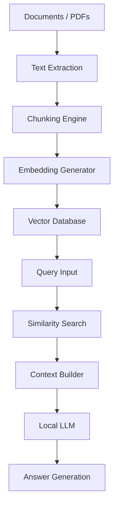

---

## 6. Knowledge Intelligence Mapping

| Stage             | Purpose                             |
| ----------------- | ----------------------------------- |
| Chunking          | Break documents into semantic units |
| Embeddings        | Convert meaning into vectors        |
| Vector Search     | Retrieve relevant knowledge         |
| Context Injection | Ground the LLM                      |
| Generation        | Produce human-readable answers      |

---

## 7. Value Proposition

Transforms:

Static documents → Intelligent knowledge system

Enables:

* Context-aware answers
* Faster decision making
* Explainable AI responses
* Offline knowledge access
* Secure internal deployments

---

# PART 2 — Technical Architecture

## 1. System Architecture Overview

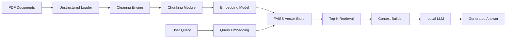

---

## 2. Component-Level Architecture

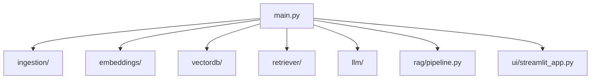

---

## 3. Retrieval Pipeline Flow

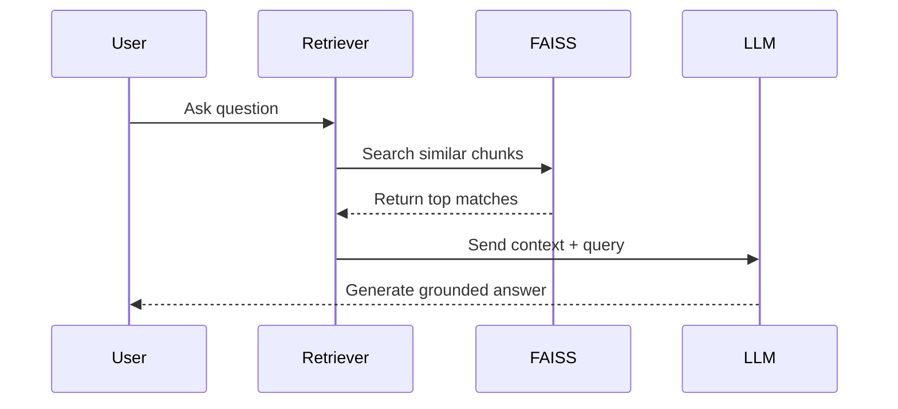

---

## 4. Module Responsibilities

### ingestion/

Handles document understanding.

* Loads PDFs using unstructured
* Cleans extracted text
* Splits into semantic chunks
* Attaches metadata

### embeddings/

Handles semantic representation.

* Loads SentenceTransformer model
* Converts chunks → vectors
* Batch processing
* Saves embedding cache

### vectordb/

Handles vector infrastructure.

* Creates FAISS index
* Stores embeddings
* Performs similarity search

### retriever/

Handles knowledge lookup.

* Converts query → embedding
* Retrieves top-k chunks
* Returns relevant context

### llm/

Handles reasoning and generation.

* Loads local GGUF model via llama-cpp
* Builds prompt with retrieved context
* Generates final answer

### rag/

Central orchestration layer:

Query → Retrieve → Build Prompt → Generate Answer

### ui/

User interaction layer.

* Streamlit chat interface
* Displays answers
* Shows retrieved sources

---

## 5. File Architecture

```
offline-rag-bot/
│
├── data/
│   ├── raw/
│   └── processed/
│
├── ingestion/
├── embeddings/
├── vectordb/
├── retriever/
├── llm/
├── rag/
├── ui/
├── configs/
├── scripts/
├── tests/
│
├── requirements.txt
├── README.md
└── main.py
```

---

## 6. Data Flow Diagram

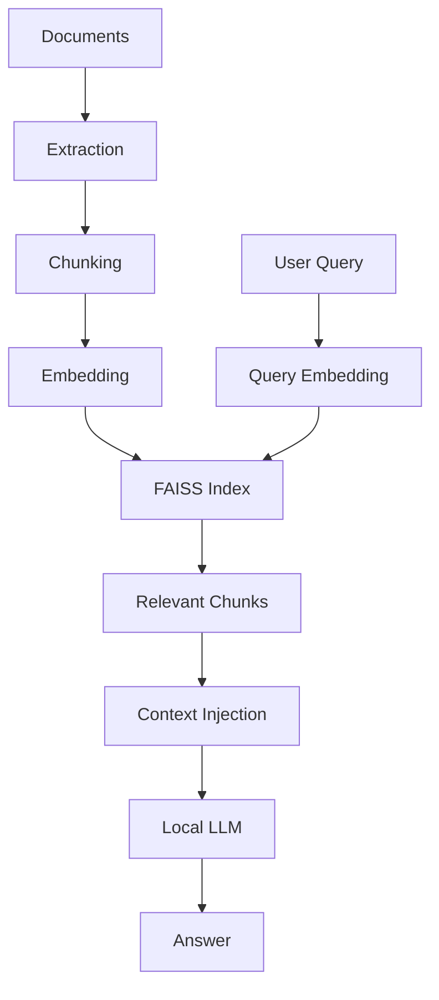

---

# PART 3 — Outputs & Implementation Guide

## Expected Outputs

### Answer Output

The chatbot returns:

* Context-grounded responses
* Relevant knowledge extracted from documents
* Traceable sources

Example:

```
Answer:
The SOP requires safety gloves in Zone A.

Sources:
doc1.pdf — Page 3
doc2.pdf — Page 7
```

---

### Knowledge Retrieval Output

The system internally produces:

* Top-k matched chunks
* Similarity scores
* Context for LLM grounding

---

## System Output Architecture

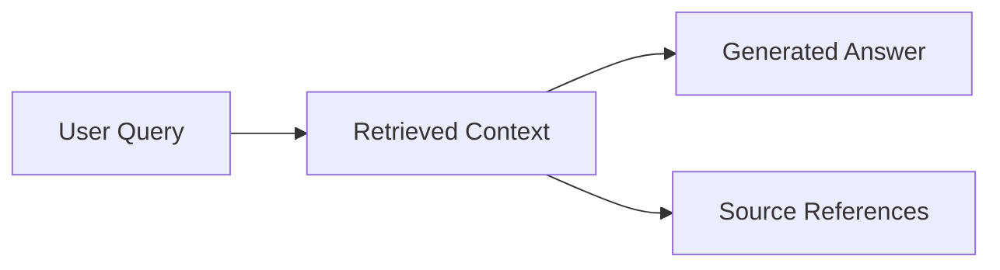

---

## Implementation Guide

### Step 1 : Install Dependencies

```
pip install -r requirements.txt
```

### Step 2 : Add Documents

Place PDFs inside:

```
data/raw/
```

### Step 3 : Run Ingestion

```
python scripts/ingest_docs.py
```

### Step 4 : Build Vector Index

```
python scripts/build_index.py
```

### Step 5 : Launch Chat Interface

```
streamlit run ui/streamlit_app.py
```

---

## Runtime Execution Flow

When the system runs:

* Documents are parsed and cleaned
* Text is split into semantic chunks
* Embeddings are generated locally
* FAISS builds a searchable index
* User asks a question
* Relevant chunks are retrieved
* Context is injected into the prompt
* Local LLM generates grounded response

This simulates an enterprise-grade offline knowledge assistant.

---

## Tech Stack

* Python
* SentenceTransformers
* FAISS
* llama-cpp-python
* Streamlit
* Unstructured

---

## Design Approach

* Fully offline execution
* No cloud dependencies
* Modular architecture
* Explainable retrieval

---

## Why This Prototype Is Different

This is not just a chatbot.

It demonstrates:

* Semantic document understanding
* Vector-based knowledge retrieval
* Context-aware reasoning
* Explainable AI answers
* Fully offline AI deployment

This makes the system applicable to:

* Internal knowledge assistants
* Enterprise documentation copilots
* Compliance knowledge engines
* Secure offline AI deployments

---

## Future Enhancements

### Short-Term

* Hybrid search (BM25 + vector)
* Better prompt engineering
* Faster indexing

### Mid-Term

* Multi-document ranking
* Context compression
* Query memory

### Advanced

* Multi-modal ingestion
* Enterprise knowledge graph
* Agent-based reasoning
* Department-specific copilots

---

## Strategic Guardrails

Before adding any new feature, validate:

* Does this improve knowledge retrieval?
* Does this improve answer accuracy?
* Does this maintain offline capability?
* Does this preserve explainability?

If not aligned, it should not be implemented.

---

## Core Project Identity

An AI-powered offline knowledge intelligence layer for document-driven organizations.

Not a demo.
Not a tutorial.
A production-aligned semantic knowledge system.


# AI-Powered Worker Posture & Safety Monitoring

## Computer Vision Prototype (YOLO + OpenCV)

> A real-time computer vision system that converts industrial camera feeds into posture-based safety intelligence, risk signals, and operational analytics.

An AI-powered safety intelligence layer that converts industrial camera footage into structured posture insights, safety alerts, and analytics.

---

# PART 1 :- Problem Statement, Strategy & Product Alignment

## 1️:- Problem Context

Industrial environments such as factories, warehouses, and construction sites face continuous operational and safety challenges:

* Workers maintain unsafe postures leading to injuries
* Manual inspections are slow and inconsistent
* CCTV cameras capture footage but provide no intelligence
* Compliance documentation lacks automated evidence
* Safety violations are identified only after incidents occur

Organizations need an automated system that interprets camera feeds and extracts real-time safety insights.

---

## 2️:- Business Problem (Contextualized for Industrial Safety Platforms)

Modern safety and operations platforms focus on:

* Camera-powered inspections
* Safety compliance tracking
* Workflow automation
* Operational intelligence
* Video-based monitoring

However, raw video footage alone does NOT provide:

* Ergonomic risk visibility
* Worker behavior intelligence
* Automated posture monitoring
* Safety analytics

This project introduces a computer vision intelligence layer that converts passive video into structured safety signals.

---

## 3️:- Proposed Solution

We design an AI module that:

1. Detects workers using a pretrained YOLO model

2. Classifies posture (heuristic-based estimation):

   * Standing
   * Sitting
   * Bending

3. Assigns safety labels:

   * SAFE
   * MONITOR
   * RISK

4. Generates analytics from video streams

This simulates an intelligent inspection camera system capable of converting visual data into operational safety insights.

---

## 4️:- Alignment with Industrial Product Vision

This prototype directly supports:

* Video-powered inspections
* AI-driven safety monitoring
* Compliance documentation
* Operational productivity insights

It can act as a foundation for:

* Smart inspection cameras
* Ergonomic risk monitoring systems
* Automated safety reporting tools

---

## 5️:- Conceptual System Flow

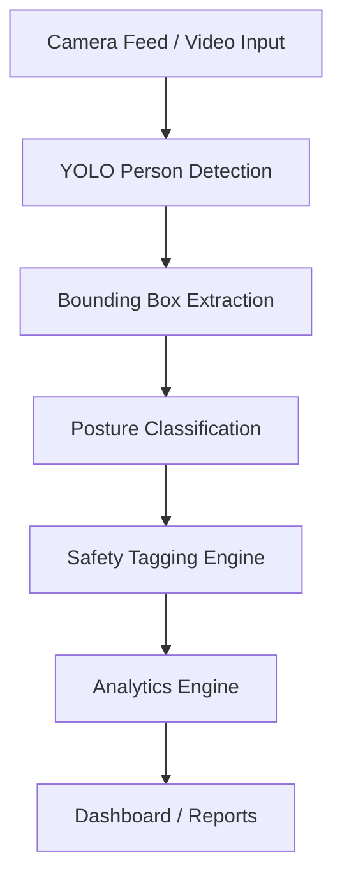

---

## 6️:- Safety Intelligence Mapping

| Posture  | Interpretation                   | Safety State |
| -------- | -------------------------------- | ------------ |
| Standing | Normal working posture           | SAFE         |
| Sitting  | Idle / monitoring required       | MONITOR      |
| Bending  | Potential ergonomic risk posture | RISK         |

---

## 7️:- Value Proposition

Transforms:

Passive video → Active safety intelligence

Enables:

* Early risk awareness
* Compliance support
* Automated inspections
* Operational insights from visual data

---

# Technical Architecture

## 1️: System Architecture Overview

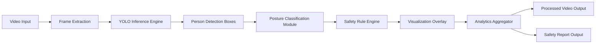

---

## 2️: Component-Level Architecture

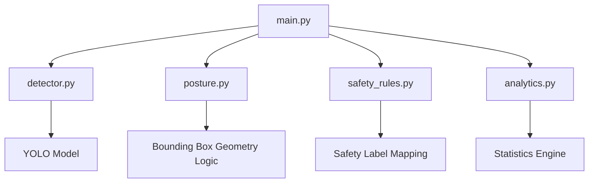

---

## 3️: Detection Pipeline Flow

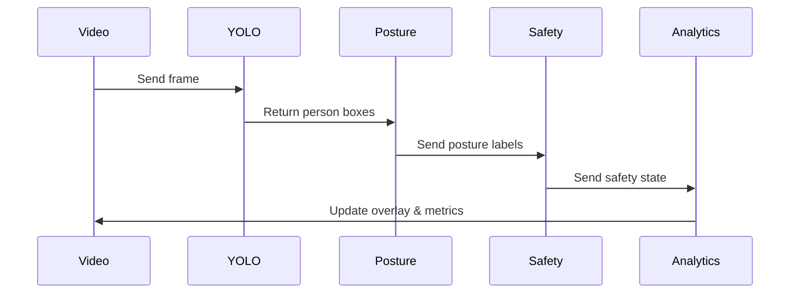

---

## 4️: Module Responsibilities

### `detector.py`

* Loads YOLO model
* Detects people in frames
* Returns bounding boxes

---

### `posture.py`

Posture estimation using bounding box geometry:

```
height / width ratio
```

* Tall box → Standing
* Medium ratio → Sitting
* Short/Wide box → Bending

---

### `safety_rules.py`

| Input    | Output  |
| -------- | ------- |
| Standing | SAFE    |
| Sitting  | MONITOR |
| Bending  | RISK    |

---

### `analytics.py`

Tracks:

* Total workers detected
* Posture distribution
* Risk frequency
* Frame-wise statistics

---

### `main.py`

Central pipeline:

```
Frame → Detect → Classify → Tag → Draw → Analyze → Save
```

---

## 5️: File Architecture

```
knowella_cv_safety_ai/
│
├── data/
│   └── sample_video.mp4
│
├── models/   (auto-managed by YOLO if weights are downloaded)
│
├── src/
│   ├── detector.py
│   ├── posture.py
│   ├── safety_rules.py
│   ├── analytics.py
│   └── main.py
│
├── outputs/
│   ├── processed_video.mp4
│   └── analytics_report.txt
│
├── requirements.txt
└── README.md
```

---

## 6️: Data Flow Diagram

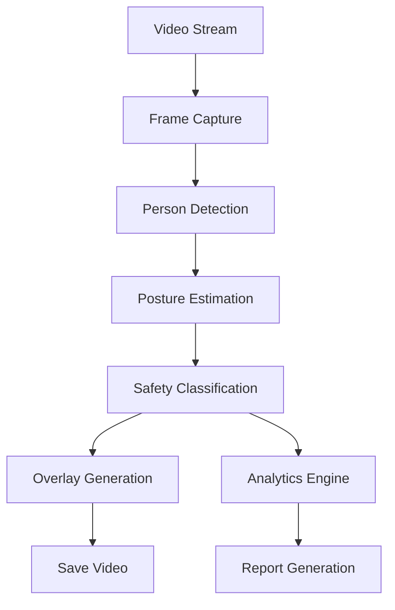

---

# Outputs & Implementation Guide

## Expected Outputs

### Visual Output

Processed video showing:

* Bounding boxes
* Posture labels
* Safety tags
* Confidence scores

Example overlay:

```
Standing | SAFE | 0.87
Bending  | RISK | 0.81
```

---

## Analytics Report

```
Frames processed: 500

Posture Distribution:
Standing: 62%
Sitting: 14%
Bending: 24%

Risk Events Detected: 41
```

---

## System Output Architecture

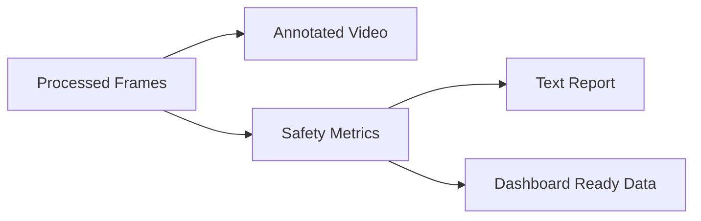

---

# Implementation Guide

## Step 1 : Install Dependencies

```bash
pip install ultralytics opencv-python numpy
```

---

## Step 2 : Add Input Video

Place video inside:

```
/data/sample_video.mp4
```

---

## Step 3 : Run System

```bash
python src/main.py
```

---

## Step 4 : Outputs Generated

* Annotated video saved in `/outputs`
* Safety analytics report generated

---

# Real Execution Outputs

## 1) Processed Video

Saved at:

```
outputs/processed_video.mp4
```

Contains:

* Detection boxes
* Posture labels
* Safety tags
* Confidence scores

This serves as visual proof of system functionality.

---

## 2) Analytics Report

Saved at:

```
outputs/analytics_report.txt
```

Contains:

* Total frames processed
* Total person detections
* Posture distribution
* Risk event summary

---

# Runtime Execution Flow

When `main.py` is executed:

1. Video frames are read using OpenCV
2. YOLO detects persons in each frame
3. Bounding box geometry is used for posture estimation
4. Safety rules convert posture → safety state
5. Overlays are drawn on frames
6. Analytics engine updates statistics
7. Annotated frames are saved into output video
8. Final analytics report is generated

This simulates an AI-powered safety inspection pipeline.

---

# Tech Stack

* Python
* YOLOv8 (Ultralytics)
* OpenCV
* NumPy

Design approach:

* Fully local execution
* No paid APIs
* Modular architecture
* Real-time video processing

---

# Why This Prototype Is Different

This is not just an object detection demo.

It demonstrates:

* Behavioral interpretation using computer vision
* Safety intelligence extraction from video
* Risk-aware posture monitoring
* Modular production-style architecture
* Analytics generation from visual data

This makes the system applicable to:

* Smart inspection cameras
* Workplace safety monitoring
* Compliance reporting systems
* Operational analytics platforms

---

# Future Enhancements

## Short-Term

* FPS monitoring
* Person tracking across frames
* Zone-based safety alerts

## Mid-Term

* Persistent bending detection
* Worker presence tracking
* Automated safety violation alerts

## Advanced

* Pose estimation using keypoints
* PPE detection (helmet/vest)
* Fall detection
* Integration with inspection workflows

---

# Strategic Guardrails

Before adding any new feature, validate:

* Does this improve safety monitoring?
* Does this help compliance tracking?
* Does this add inspection intelligence?
* Does this align with AI camera analytics?

If not aligned, it should not be implemented.

---

# Core Project Identity

An AI-powered safety intelligence layer for smart industrial camera systems.

Not a demo.
Not a tutorial.
A product-aligned prototype.
