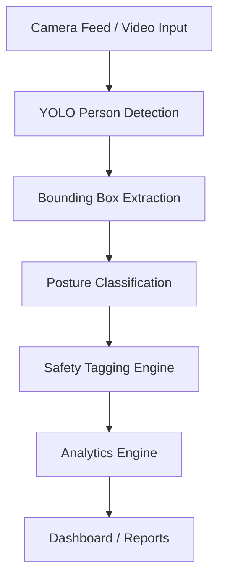
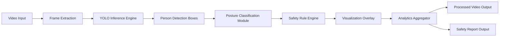
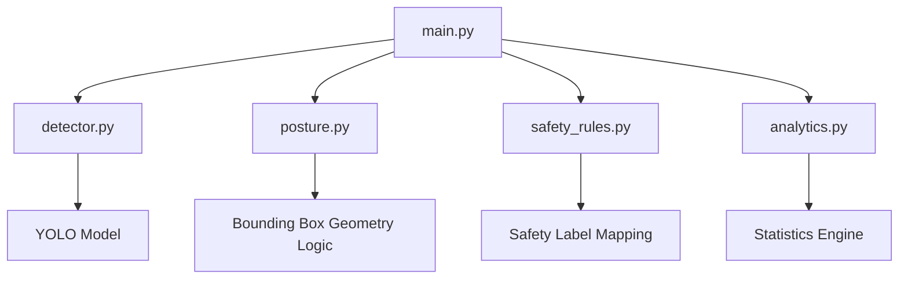
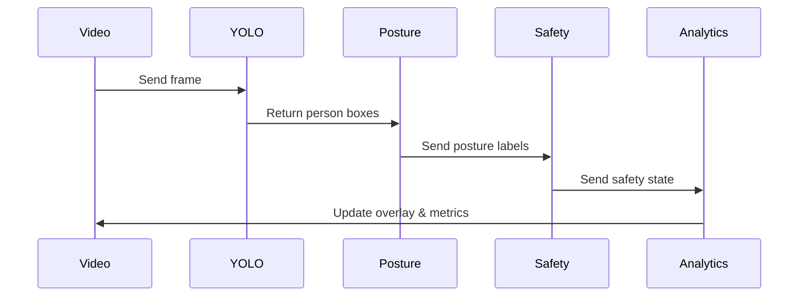
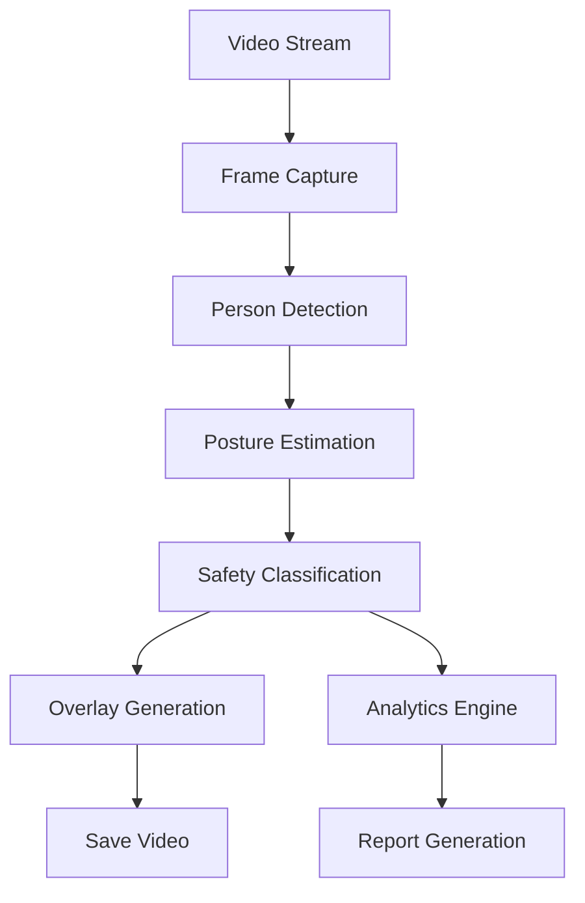
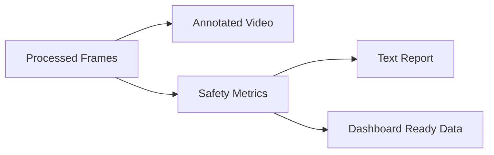

# AI-Powered Worker Posture & Safety Monitoring

## Computer Vision Prototype (YOLO + OpenCV)

> A real-time computer vision system that converts industrial camera feeds into posture-based safety intelligence, risk signals, and operational analytics.

An AI-powered safety intelligence layer that converts industrial camera footage into structured posture insights, safety alerts, and analytics.

---


#  Problem Statement, Strategy & Product Alignment

## 1️:- Problem Context

Industrial environments such as factories, warehouses, and construction sites face continuous operational and safety challenges:

* Workers maintain unsafe postures leading to injuries
* Manual inspections are slow and inconsistent
* CCTV cameras capture footage but provide no intelligence
* Compliance documentation lacks automated evidence
* Safety violations are identified only after incidents occur

Organizations need an automated system that interprets camera feeds and extracts real-time safety insights.

---

## 2️:- Business Problem (Contextualized for Industrial Safety Platforms)

Modern safety and operations platforms focus on:

* Camera-powered inspections
* Safety compliance tracking
* Workflow automation
* Operational intelligence
* Video-based monitoring

However, raw video footage alone does NOT provide:

* Ergonomic risk visibility
* Worker behavior intelligence
* Automated posture monitoring
* Safety analytics

This project introduces a computer vision intelligence layer that converts passive video into structured safety signals.

---

## 3️:- Proposed Solution

We design an AI module that:

1. Detects workers using a pretrained YOLO model

2. Classifies posture (heuristic-based estimation):

   * Standing
   * Sitting
   * Bending

3. Assigns safety labels:

   * SAFE
   * MONITOR
   * RISK

4. Generates analytics from video streams

This simulates an intelligent inspection camera system capable of converting visual data into operational safety insights.

---

## 4️:- Alignment with Industrial Product Vision

This prototype directly supports:

* Video-powered inspections
* AI-driven safety monitoring
* Compliance documentation
* Operational productivity insights

It can act as a foundation for:

* Smart inspection cameras
* Ergonomic risk monitoring systems
* Automated safety reporting tools

---

## 5️:- Conceptual System Flow



---

## 6️:- Safety Intelligence Mapping

| Posture  | Interpretation                   | Safety State |
| -------- | -------------------------------- | ------------ |
| Standing | Normal working posture           | SAFE         |
| Sitting  | Idle / monitoring required       | MONITOR      |
| Bending  | Potential ergonomic risk posture | RISK         |

---

## 7️:- Value Proposition

Transforms:

Passive video → Active safety intelligence

Enables:

* Early risk awareness
* Compliance support
* Automated inspections
* Operational insights from visual data

---

# Technical Architecture

## 1️: System Architecture Overview



---

## 2️: Component-Level Architecture



---

## 3️: Detection Pipeline Flow



---

## 4️: Module Responsibilities

### `detector.py`

* Loads YOLO model
* Detects people in frames
* Returns bounding boxes

---

### `posture.py`

Posture estimation using bounding box geometry:

```
height / width ratio
```

* Tall box → Standing
* Medium ratio → Sitting
* Short/Wide box → Bending

---

### `safety_rules.py`

| Input    | Output  |
| -------- | ------- |
| Standing | SAFE    |
| Sitting  | MONITOR |
| Bending  | RISK    |

---

### `analytics.py`

Tracks:

* Total workers detected
* Posture distribution
* Risk frequency
* Frame-wise statistics

---

### `main.py`

Central pipeline:

```
Frame → Detect → Classify → Tag → Draw → Analyze → Save
```

---

## 5️: File Architecture

```
knowella_cv_safety_ai/
│
├── data/
│   └── sample_video.mp4
│
├── models/   (auto-managed by YOLO if weights are downloaded)
│
├── src/
│   ├── detector.py
│   ├── posture.py
│   ├── safety_rules.py
│   ├── analytics.py
│   └── main.py
│
├── outputs/
│   ├── processed_video.mp4
│   └── analytics_report.txt
│
├── requirements.txt
└── README.md
```

---

## 6️: Data Flow Diagram



---

# Outputs & Implementation Guide

## Expected Outputs

### Visual Output

Processed video showing:

* Bounding boxes
* Posture labels
* Safety tags
* Confidence scores

Example overlay:

```
Standing | SAFE | 0.87
Bending  | RISK | 0.81
```

---

## Analytics Report

```
Frames processed: 500

Posture Distribution:
Standing: 62%
Sitting: 14%
Bending: 24%

Risk Events Detected: 41
```

---

## System Output Architecture



---

# Implementation Guide

## Step 1 : Install Dependencies

```bash
pip install ultralytics opencv-python numpy
```

---

## Step 2 : Add Input Video

Place video inside:

```
/data/sample_video.mp4
```

---

## Step 3 : Run System

```bash
python src/main.py
```

---

## Step 4 : Outputs Generated

* Annotated video saved in `/outputs`
* Safety analytics report generated

---

# Real Execution Outputs

## 1) Processed Video

Saved at:

```
outputs/processed_video.mp4
```

Contains:

* Detection boxes
* Posture labels
* Safety tags
* Confidence scores

This serves as visual proof of system functionality.

---

## 2) Analytics Report

Saved at:

```
outputs/analytics_report.txt
```

Contains:

* Total frames processed
* Total person detections
* Posture distribution
* Risk event summary

---

# Runtime Execution Flow

When `main.py` is executed:

1. Video frames are read using OpenCV
2. YOLO detects persons in each frame
3. Bounding box geometry is used for posture estimation
4. Safety rules convert posture → safety state
5. Overlays are drawn on frames
6. Analytics engine updates statistics
7. Annotated frames are saved into output video
8. Final analytics report is generated

This simulates an AI-powered safety inspection pipeline.

---

# Tech Stack

* Python
* YOLOv8 (Ultralytics)
* OpenCV
* NumPy

Design approach:

* Fully local execution
* No paid APIs
* Modular architecture
* Real-time video processing

---

# Why This Prototype Is Different

This is not just an object detection demo.

It demonstrates:

* Behavioral interpretation using computer vision
* Safety intelligence extraction from video
* Risk-aware posture monitoring
* Modular production-style architecture
* Analytics generation from visual data

This makes the system applicable to:

* Smart inspection cameras
* Workplace safety monitoring
* Compliance reporting systems
* Operational analytics platforms

---

# Future Enhancements

## Short-Term

* FPS monitoring
* Person tracking across frames
* Zone-based safety alerts

## Mid-Term

* Persistent bending detection
* Worker presence tracking
* Automated safety violation alerts

## Advanced

* Pose estimation using keypoints
* PPE detection (helmet/vest)
* Fall detection
* Integration with inspection workflows

---

# Strategic Guardrails

Before adding any new feature, validate:

* Does this improve safety monitoring?
* Does this help compliance tracking?
* Does this add inspection intelligence?
* Does this align with AI camera analytics?

If not aligned, it should not be implemented.

---

# Core Project Identity

An AI-powered safety intelligence layer for smart industrial camera systems.

Not a demo.
Not a tutorial.
A product-aligned prototype.


---

# THIRD PART OF THE ASSIGNMENT 


---

## Short Concept Answers

### 1. What is a RAG system and why is it better than a plain chatbot?

A RAG (Retrieval-Augmented Generation) system first retrieves relevant information from real documents and then generates answers using that context. This makes the responses more accurate, grounded, and domain-specific.  
Unlike a plain chatbot that depends only on what it learned during training, a RAG system reduces guesswork and provides answers based on actual data.

For a deeper architectural understanding, you can read my detailed write-up here:  
**Best RAG Architecture for Your Company’s Next Project**  
https://medium.com/@genaishaktesh/best-rag-architecture-for-your-companys-next-project-e86f0dcbea01


### 2. What are embeddings and why are they used in vector search?

Embeddings convert text into numerical representations that capture meaning and context rather than just exact words. This allows the system to find content that is semantically similar to a query, even if the wording is different.  

Because of this, vector search feels more intelligent it matches intent, not just keywords.

For a more detailed technical explanation, you can refer to my research document:  
https://docs.google.com/document/d/1-V6CoUKHA80W1AUkMBG7sGQvIk11eRcxtRUdkFBc4hQ/edit?tab=t.0


### 3. How does YOLO differ from traditional object detection methods?

Traditional object detection methods usually work in multiple stages first identifying possible regions in an image and then classifying the objects inside them.  

YOLO (You Only Look Once) takes a different approach. It performs detection and classification in a single pass, predicting bounding boxes and object classes at the same time. This makes it significantly faster and ideal for real-time applications like CCTV monitoring, industrial safety systems, and live video analysis.


### 4. One challenge in real-world posture detection and how you’d handle it

In real-world environments, posture detection is not always straightforward because camera angles, lighting, and obstacles can affect visibility. Workers may be partially hidden behind machines, other people, or equipment, which makes it difficult for a system to clearly understand their body position.  

In crowded or fast-moving areas, simple bounding-box–based methods can sometimes give incorrect posture estimates.

To make the system more reliable, we can move beyond basic box measurements and use pose estimation models that track body joints like shoulders, hips, and knees. Additionally, by tracking the same person across multiple frames, the system can understand posture more consistently even if visibility changes for a moment.  

This makes detection more stable and much closer to real-world working conditions.


THANKYOU SO MUCH AND HAVE A GREAT YEAR AHEAD ! MAY YOU WIN THIS TIME :) SHAKTESH PANDEY - https://linktr.ee/Shaktesh_Pandey 

